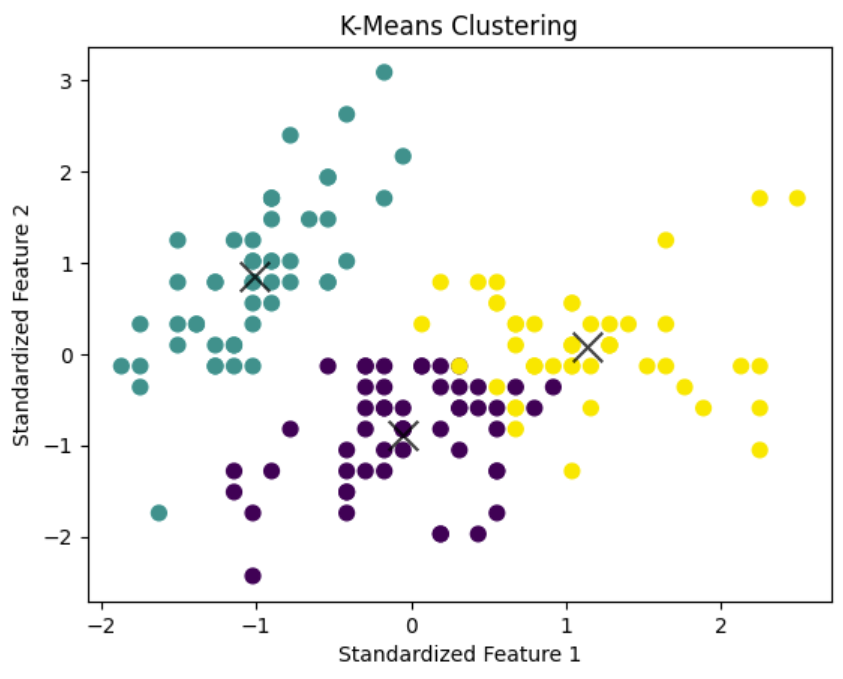
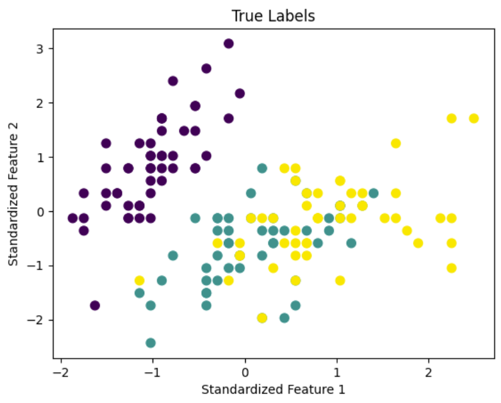

Clustering is a fundamental technique in the field of unsupervised machine learning, allowing us to discover hidden patterns and group similar data points together. One popular algorithm for clustering is K-Means, and in this blog post, we'll walk through a hands-on example using the well-known Iris dataset.

## The Dataset

The Iris dataset is a classic dataset in machine learning, often used for testing and learning purposes. It consists of 150 samples of iris flowers, each belonging to one of three species: setosa, versicolor, or virginica. The features include sepal length, sepal width, petal length, and petal width.

```cpp
# Load the data
iris = load_iris()

# Display the data
print(iris.DESCR)
```
## Standardization
Before applying K-Means, we standardize the features. Standardization ensures that all features contribute equally to the distance computation, preventing one feature from dominating the others due to a difference in scale.
```cpp
X_iris = iris.data
y_iris = iris.target

scaler = StandardScaler()
X_scaled = scaler.fit_transform(X_iris)
```
## ML Models
### K-Means Clustering
In our example, we set the number of clusters (K) to 3 since we know that there are three species of iris in the dataset. The algorithm then groups the data points into three clusters based on their similarity.
```cpp
kmeans = KMeans(n_clusters=3, random_state=0)
kmeans.fit(X_scaled)
y_kmeans = kmeans.predict(X_scaled)
```

## Visualizing the Data 
The true power of K-Means becomes apparent when we visualize the clustered data. The scatter plot showcases the distinct clusters, with different colors representing each cluster. Additionally, we mark the cluster centers with black 'x' markers.
```cpp
# Plot the clustered data
plt.scatter(X_scaled[:, 0], X_scaled[:, 1], c=y_kmeans, s=50, cmap='viridis')

# Plot the centers of the clusters
centers = kmeans.cluster_centers_
plt.scatter(centers[:, 0], centers[:, 1], c='black', s=200, alpha=0.75, marker='x')
```


To assess the performance of our clustering, we compare the results with the true labels of the Iris dataset. This step is crucial in real-world scenarios where the actual labels are known, helping us evaluate the effectiveness of the clustering algorithm.
```cpp
plt.scatter(X_scaled[:, 0], X_scaled[:, 1], c=y_iris, s=50, cmap='viridis')
```


## Conclusion
In this blog post, we've explored the application of K-Means clustering on the Iris dataset. The code provided serves as a starting point for anyone looking to dive into clustering using a well-known dataset. 

Source: <a href="https://github.com/shreyasharathi/shreyasharathi.github.io/blob/main/Notebooks/kmeans.ipynb"><i class="large github icon "></i>k-means</a>
