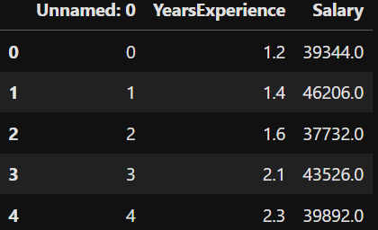
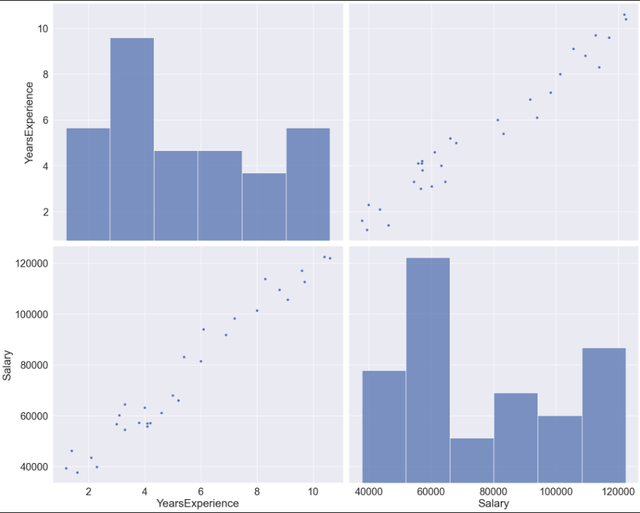
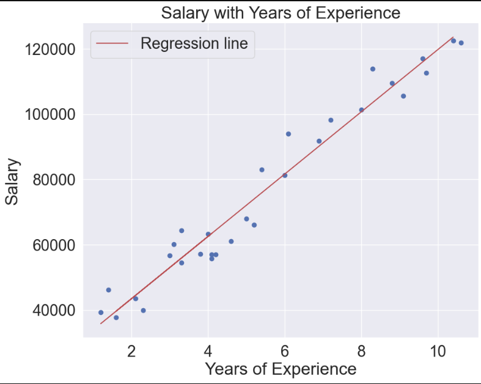

In this blog post, we'll look into a salary dataset and employ linear regression to understand the relationship between years of experience and salary. Linear regression in machine learning is a supervised learning algorithm used for predicting a continuous outcome variable based on one or more input features. It establishes a linear relationship between the input features and the target variable by finding the best-fitting line through the data points.

## The Dataset

Our dataset contains 30 entries of our two variables, Years of experience and Salary. Let's load the dataset.

```cpp
df = pd.read_csv('Salary_dataset.csv')
df.head()
```



We'll clean our data by dropping unnecessary columns and checking for missing or duplicated values.
```cpp
# Drop the 'Unnamed: 0' column
df.drop('Unnamed: 0', axis=1, inplace=True)
# Check for Null values
df.isna().sum()
# Check for Duplicated values
df.duplicated().sum()
```


## Exploratory Data Analysis (EDA)

To gain insights into the dataset, we'll compute correlations and create visualizations, such as pair plots and scatter plots.
```cpp

# Compute the correlation matrix
correlation_matrix = df.corr()
sns.set(font_scale=2)
sns.pairplot(df, height=8, aspect=10/8)
```


## ML Models
### 1.Linear Regression
Now, it's time to build our linear regression model. We'll split the data into training and testing sets, create the model, and fit it to the training data.
```cpp
# Prepare the data
x = df['YearsExperience'].values.reshape(-1, 1)
y = df['Salary'].values.reshape(-1, 1)

# Split the data into training and testing sets
x_train, x_test, y_train, y_test = train_test_split(x, y, test_size=0.15)

# Create a linear regression model
lr = LinearRegression()

# Fit the model to the training data
lr.fit(x_train, y_train)
```

## Visualization of Regression Line
Visualizing the regression line on our scatter plot will help us understand how well our model fits the data.
```cpp
# Visualize the regression line
plt.scatter(x, y)
plt.xlabel("Years of Experience")
plt.ylabel("Salary")
plt.plot(x_test, lr.predict(x_test), color="r", label="Regression line")
plt.title("Salary with Years of Experience")
plt.grid(True)
plt.legend()
plt.show()
```


## Model Evaluation
To assess the performance of our model, we'll calculate key metrics such as mean absolute error, mean squared error, and R-squared.
```cpp
# Make predictions on the test set
y_preds = lr.predict(x_test)

# Evaluate the model
print("Mean Absolute Error =", mean_absolute_error(y_test, y_preds))
print("Mean Squared Error =", mean_squared_error(y_test, y_preds))
print("R-squared =", r2_score(y_test, y_preds))
```
Upon evaluation,
Mean Absolute Error =  3856.3599427002528 <br>
Mean Squared Error =  19646866.89869981 <br>
R-squared =  0.9794041289245915

## Conclusion
In conclusion, our exploration into the salary dataset using linear regression has provided valuable insights into the relationship between years of experience and salary.
