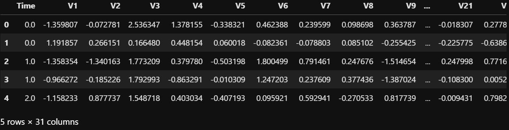
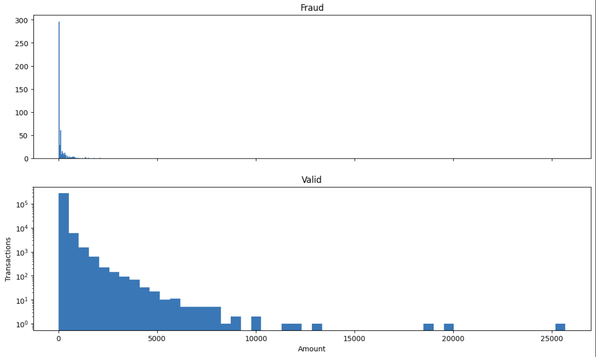
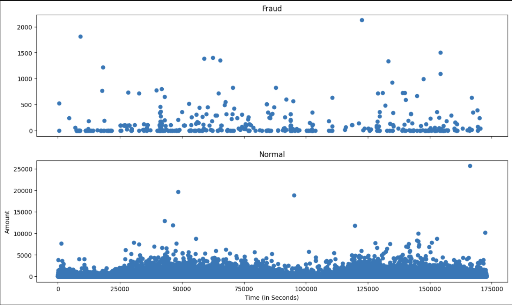
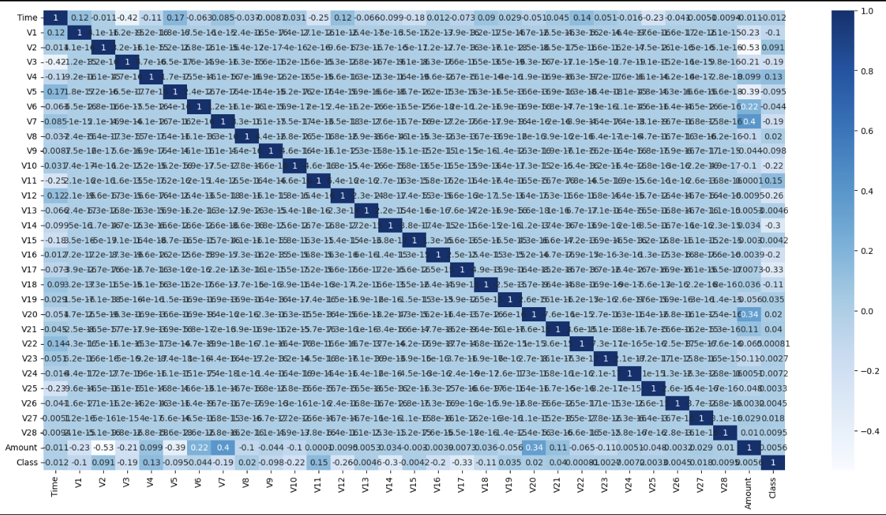
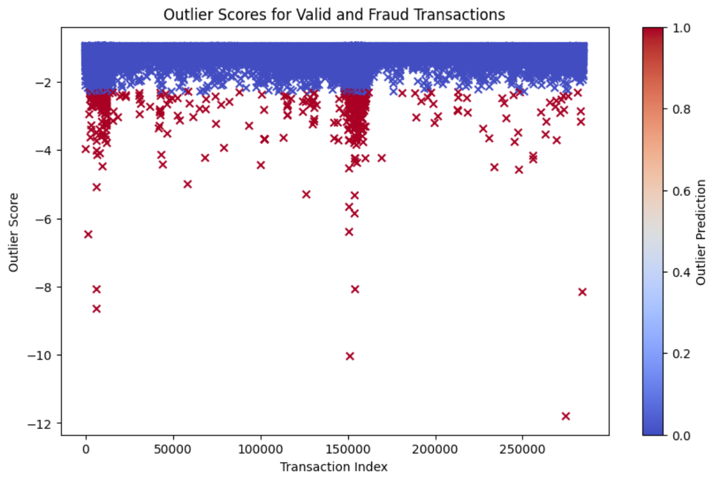

A classic example to demostrate anamoly and oultier detection is detection of credit card fraud. In the era of digital transactions, credit card fraud has become a prevalent issue. To tackle this problem, machine learning techniques can be employed for anomaly detection.

## THE DATASET

The datasets contains transactions made by credit cards in September 2013 by european cardholders. This dataset presents transactions that occurred in two days, where we have 492 frauds out of 284,807 transactions.  

```cpp
data = pd.read_csv('creditcard.csv',sep=',')
data.head()
```


## EDA
```cpp
Fraud = data[data['Class']==1]
Valid = data[data['Class']==0]
outlier_fraction = len(Fraud)/float(len(Valid))
print("Fraud Cases : {}".format(len(Fraud)))
print("Valid Cases : {}".format(len(Valid)))
print(outlier_fraction)
```
After running this code, we can see that there are 492 fraud cases and they account for 0.0017 of the transactions.
Let's explore the dataset with some visualizations before we apply our models. This will help us understand the problem better. Let us designate Fraud Transactions with '1' and Valid transctions with '0'.
Let us generate a plot to see the Amount of Transactions per Class.
```cpp
f, (ax1, ax2) = plt.subplots(2, 1, sharex=True)
bins = 50
ax1.hist(fraud.Amount, bins = bins)
ax1.set_title('Fraud')
ax2.hist(normal.Amount, bins = bins)
ax2.set_title('Valid')
plt.xlabel('Amount')
plt.ylabel('Transactions')
plt.yscale('log')
plt.show()
```


Let us generate a plot to visualize time of transaction vs amount per class
```cpp
f, (ax1, ax2) = plt.subplots(2, 1, sharex=True)
ax1.scatter(fraud.Time, fraud.Amount)
ax1.set_title('Fraud')
ax2.scatter(normal.Time, normal.Amount)
ax2.set_title('Normal')
plt.xlabel('Time (in Seconds)')
plt.ylabel('Amount')
plt.show()
```


Let us generate crrelation of each feature.
```cpp
cor1 = data.corr()
features = cor1.index
plt.figure(figsize=(20,20))
g=sns.heatmap(data[tfeatures].corr(),annot=True,cmap="RdYlGn")
```


## ML Models
### 1. Isolation Forest
The key idea behind Isolation Forest is that anomalies are usually the data points that are easiest to isolate or separate from the normal data. Specifically, an isolation forest uses an ensemble of decision trees, each built in a randomized fashion to isolate various instances in the data. When building each tree, the Isolation Forest algorithm randomly selects a feature and then randomly selects a split value between the maximum and minimum values of that feature. The recursively partitions or splits the data along those lines. 

### 2. LOF
LOF captures the degree of outliers by measuring the local deviation of a point compared to its neighbors. Points that stand out with respect to their local neighborhoods will have much higher LOF scores, marking them as potential anomalies. A key advantage of LOF is it does not require any assumptions about the underlying data distribution or definitions of global parameters that define outliers. It relies entirely on local neighborhoods.

The code is as follows:
```cpp
classifiers = {
    "Isolation Forest":IsolationForest(n_estimators=100, max_samples=len(X), 
                                       contamination=outlier_fraction,random_state=state, verbose=0),
    "Local Outlier Factor":LocalOutlierFactor(n_neighbors=20, algorithm='auto', 
                                              leaf_size=30, metric='minkowski',
                                              p=2, metric_params=None, contamination=outlier_fraction)
   
}
```
```cpp
n_outliers = len(Fraud)
for i, (clf_name,clf) in enumerate(classifiers.items()):
    #Fit the data and tag outliers
    if clf_name == "Local Outlier Factor":
        y_pred = clf.fit_predict(X)
        scores_prediction = clf.negative_outlier_factor_
    else:    
        clf.fit(X)
        scores_prediction = clf.decision_function(X)
        y_pred = clf.predict(X)
    #Reshape the prediction values to 0 for Valid transactions , 1 for Fraud transactions
    y_pred[y_pred == 1] = 0
    y_pred[y_pred == -1] = 1
    n_errors = (y_pred != Y).sum()
```
Our final output is:


In this plot, each point on the x-axis represents a transaction, and the y-axis represents the outlier score. The color of the marker indicates whether the transaction was classified as a valid (blue) or fraudulent (red) transaction. 

## Conclusion 
Isolation Forest has an accuracy score of 0.997 and LOF has an accuracy score of 0.996. The key point of difference is that fraud detection is 31% in isolation forest whereas for LOF it is just 5%. Hence for our purposes and this dataset, isolation forest would be more useful.
