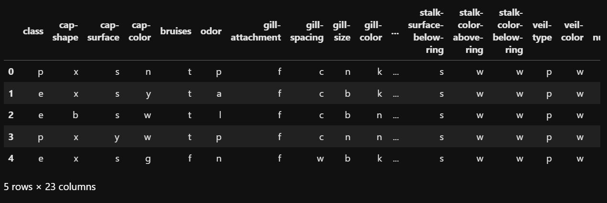
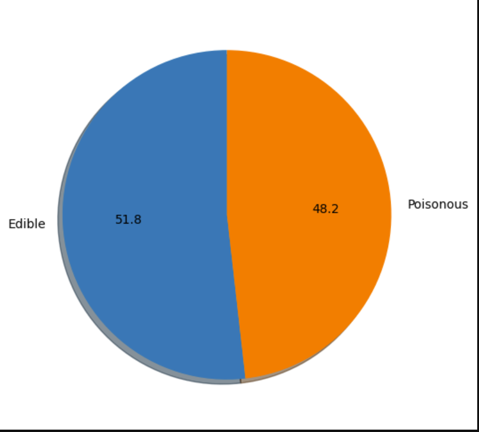
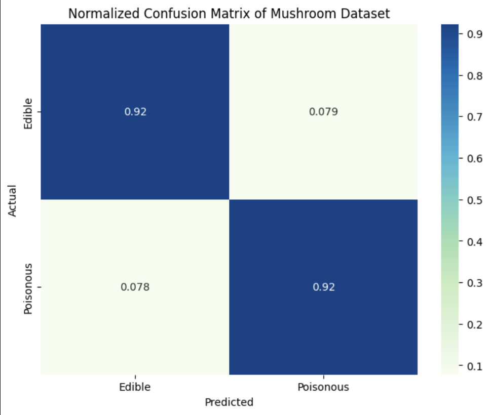
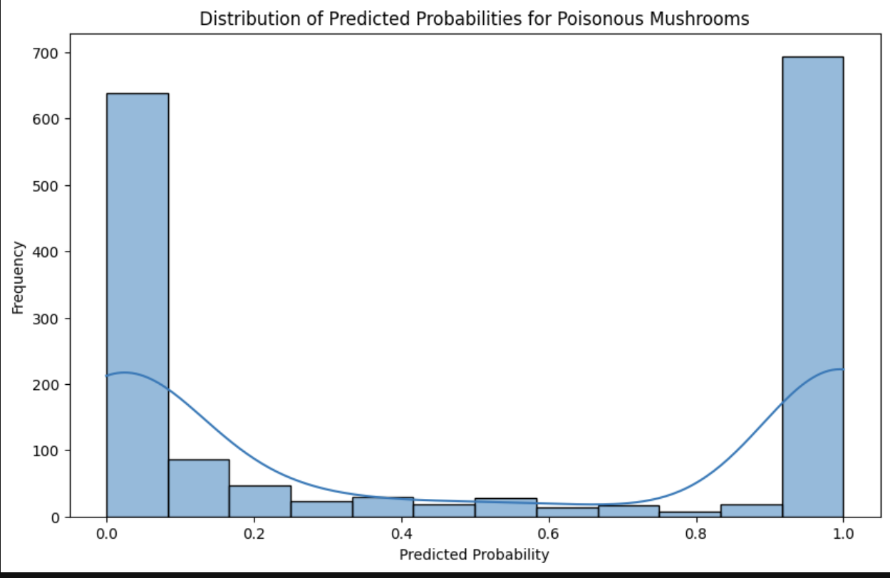

In this blog post, we are going to predict if a mushroom is poisonous or not. We are going to apply naive bayes method, which is based on the bayes theorem in probability. 

## The Dataset
This dataset includes descriptions of hypothetical samples corresponding to 23 species of gilled mushrooms in the Agaricus and Lepiota Family Mushroom drawn from The Audubon Society Field Guide to North American Mushrooms in 1981. Each species can be identified as definitely edible, definitely poisonous, or of unknown edibility and not recommended. This latter class was combined with the poisonous one.  
So there 2 classes. Poisonous and edible.  

```cpp
df = pd.read_csv("mushrooms.csv")
df.head()
```


Let us visualize the distribution of edible and poisonous mushrooms using a pie chart
```cpp
plt.figure(figsize = (6,6))
plt.pie(df['class'].value_counts(), startangle = 90, autopct = '%.1f', labels = ['Edible', 'Poisonous'], shadow = True)
plt.show()
```


## Encoding Data

All columns are object. So we need to encode them. I am going to use Label Encoding for this.
```cpp
le = LabelEncoder()
X = df.iloc[:, 1:].apply(le.fit_transform).values
le = LabelEncoder()
y = np.array(le.fit_transform(y))
y.reshape(len(y), 1)
```
Now, we will spilt the dataset into test and training data.
```cpp
X_train, X_test, y_train, y_test = train_test_split(X, y, test_size = 0.2, random_state = 0)
```

## ML Models
### 1. Gaussian Naive Bayes
Before we apply the GaussianNB method, we need to scale our data. Differences in the scales across input variables may increase the difficulty of the problem being modeled. So I am going to apply standard scaling. Standardization scales each input variable separately by subtracting the mean (called centering) and dividing by the standard deviation to shift the distribution to have a mean of zero and a standard deviation of one.

```cpp
sc = StandardScaler()
X_train = sc.fit_transform(X_train)
X_test = sc.fit_transform(X_test)
```
Now we can go ahead and try to fit out data in out model.
```cpp
classifier = GaussianNB()
classifier.fit(X_train, y_train)
y_pred = classifier.predict(X_test)
```
Using this model, we get accuracy score to be 0.92.



The resulting plot provides insights into how confident the Naive Bayes classifier is when predicting whether a mushroom is poisonous. The x-axis represents the predicted probabilities, and the y-axis represents the frequency of occurrences at each probability level. 




## Conclusion
In this blog post, we explored the GaussianNB model and achieved a score of 0.92 on our model. I do believe that other techniques might be more accurate in making the same predictions. I will update this blog when i try them out.

Source: <a href="https://github.com/shreyasharathi/shreyasharathi.github.io/blob/main/Notebooks/mushroom-predictions.ipynb"><i class="large github icon "></i>mushrooms</a>
