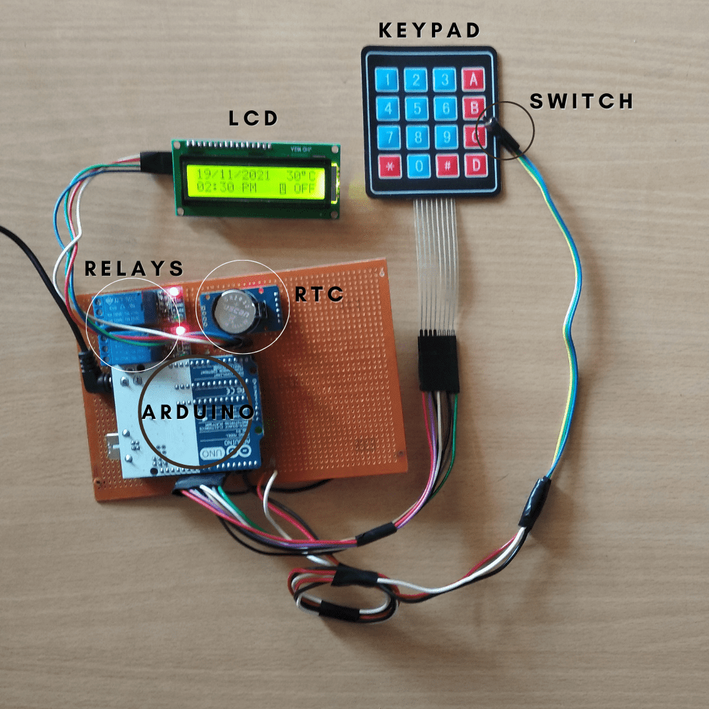

<div class="text-center p-4">
  
  
</div>

For this project, I was the lead programmer who was responsible for programming the various capabilities of the **timer based auto irrigation system**.  I started by programming the basics, such as sensor polling and motor actuation using interrupts. I also designed and tested the PCB for the embedded system. The components used were Arduino Mega, DC motor, Relays, I2C, Keypad Matrix and a GSM module.

- This system is particularly useful when it is inaccessible at night, when the situation poses a risk to the person due to low visibility in the farmlands, insects/wild animals, and other factors. 
- The system allows the user to run the motor or any other appliance without manual supervision, without any difficulties. 
- GSM was used to allow remote access to the system that improves the overall accessibility.

<h3>Specifications and Methodology</h3>

- The microcontroller used for controlling the operations is the Arduino Uno. It is a low-cost microcontroller that operates at 5V and has 2kb flash memory. The RTC 3231 Module was interfaced with the Arduino using <RTC3231.h> module. The time is loaded into the RTC at compile time and is maintained even at the loss of  power using the cell battery. The RTC module contains two interrupts that allow for up to two alarms, these were programmed into the microcontroller for providing a soft interrupt. RTC is responsible for maintaining the precision of the time.
- The 16x2 LCD module was interfaced with the Arduino using the <LCD.h> in-built module and was programmed to display the RTC date and time.
- A simple 5 V relay is used to perform a switching check to control the motor when an alarm interrupt is raised. The conventional LCD wiring was replaced with the I2C  Serial interface that allowed for a simple wiring setup and maximum usage of the Arduino’s serial communication.
- GSM is used to remotely control the product and achieve a remote-less system. With the inclusion of GSM, the user can control the irrigation system dynamically, and turn the system on or off using a mobile phone.
- An external switch is used to switch between the two modes in-built to control either a 3-phase irrigation motor or a 1-phase appliance.

We have deployed this sytem in 22 farms across Thanjavur, India.

Here is some code that illustrates how we read values from the line sensors:
```cpp
byte ADCRead(byte ch)
{
    word value;
    ADC1SC1 = ch;
    while (ADC1SC1_COCO != 1)
    {   // wait until ADC conversion is completed   
    }
    return ADC1RL;  // lower 8-bit value out of 10-bit data from the ADC
}
```
