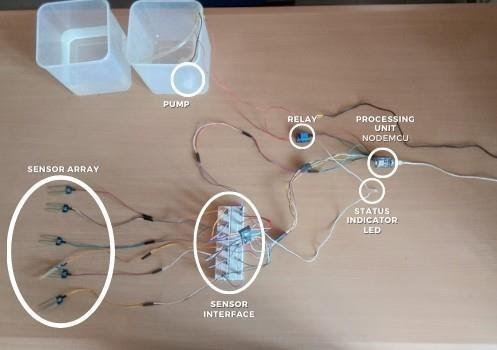
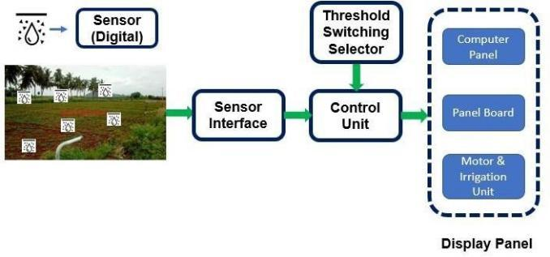
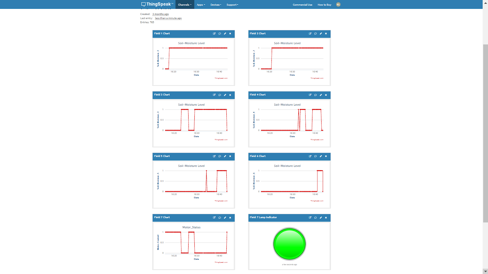

  
  
  

Smart agriculture using embedded system-based automated irrigation management is the most prominent approach and will be pivotal in revolutionizing the agricultural domain. The excess as well as inadequate irrigation damages the crops and inflicts great loss to the farmers. This paper proposes a small-scaled embedded system for the application of an irrigation system to provide a sustainable environment for the crops by implementing automation.

Published in: 2021 Innovations in Power and Advanced Computing Technologies (i-PACT). 

Refer : 
